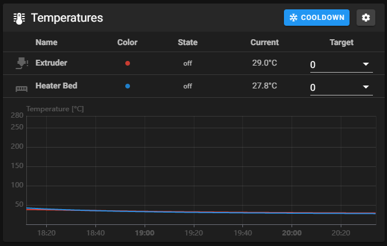

# Puesta en marcha inicial


El fichero printer.cfg es el que usa Klipper para cargar la configuración de nuestra impresora.

## Como montar nuestro printer.cfg

A día de hoy Klipper cuenta con muchos ejemplos de configuración de impresoras y electrónicas que nos pueden ayudar a disponer de una configuración base para comenzar.&#x20;

Podéis revisar estos [**ejemplos aquí desde su Github**](https://github.com/Klipper3d/klipper/tree/master/config) o por otro lado podréis acceder a ellos usando el interfaz de Klipper (Mainsail, Fluidd u otro) en el apartado de ajuste de configuraciones de máquina accediendo al **directorio /config**.

.png>)

Una vez localizado el o los ejemplos que necesitemos los copiaremos en nuestro printer.cfg asegurándonos que tenemos [**el serial id correcto para nuestra/s MCUs que encontramos durante la instalación de Klipper**](broken-reference).


Os sugerimos lo primero de todo antes de comenzar con pruebas o cambios en vuestros ficheros de configuración tener un backup de estos ficheros, podéis usar [**nuestra macro de backup a Github** ](broken-reference)que además de crearos un backup de forma sencilla podréis comparar entre ellos para ver las diferencias.



Al usar determinadas funciones o asistentes/macros de Klipper que guardan información de configuración de máquina de forma automática nos podemos encontrar hacia el final de nuestro printer.cfg con estos datos.

Es importante que NO pongamos ninguna configuración nuestra dentro o por debajo de la zona **#\*# <---------------------- SAVE\_CONFIG ---------------------->**


### Secciones a revisar de tu printer.cfg

Si usamos un printer.cfg de algún ejemplo debemos de prestar especil atención a las siguientes secciones antes de continuar con las comprobaciones iniciales:

* cadena de conexión o serial id de nuestra MCU, asegurándonos que tenemos [**el serial id correcto para nuestra/s MCUs que encontramos durante la instalación de Klipper**](broken-reference)
* tipo de termistores definidos para nuestro hotend y cama
* configuración de nuestros drivers/steppers, en especial:
  * posición de los endstops
  * posición máxima del area de impresión
  * tipo de driver
* nivelacion de cama que trataremos con más detalle más adelante
* posición y configuración de nuestro sensor de nivelación o z endstop

#### Definiciones de nuestra impresora

En la sección \[printer] de nuestro printer.cfg deberemos definir los parámetros que defined nuestro tipo de impresora como por ejemplo:

* cinemática que usa nuestra impresora
* velocidad máxima
* aceleraciones máximas

```
// Ejemplo de configuración de impresora corexy
[printer]
kinematics: corexy
max_velocity: 350
max_accel: 3000
max_z_velocity: 50
max_z_accel: 350
square_corner_velocity: 10.0
```

#### Otras secciones importantes

* secciones \[stepper_...] deberemos tener por lo menos positionendstop y position_\_max que se ajusten a nuestra impresora
* en \[tmcXXXX stepper_...] donde XXXX será e tipo de drivers por ejemplo \[TMC2208 stepper\_x] indicará que nuestro eje X usará un TMC2208_
* _\[stepper\_z] deberiamos definir position\_\_max, en algunos casos podemos tener varios Z que iremos añadiendo con Z1 Z2 Z3_
* _\[extruder] es la seción de nuestro extrusor y deberemos prestar atención al tipo de termistor definido en sensor\_\_type_
* _\[heater\_\_bed] lo mismo que hicimos para el extrusor, revisaremos que el tipo de termistor es el correcto_

## Comprobaciones iniciales

Una vez ya tenemos nuestro printer.cfg listo revisaremos que al recargar nuestra configuración no nos de ningún error y procederemos a realizar unos tests básicos.

Para ello usaremos principalmente la consola:

.png>)

Controles de movimientos:

.png>)

Y otras herramientas que nos facilita el interfaz de Klipper para gestionar nuestra máquina.

### Verificar temperaturas

La primera comprobación que debemos realizar es verificar que nuestros termistores están reportando temperatura de forma correcta y estable:



En el apartado de temperaturas de nuestro interfaz Klipper verificaremos que las temperaturas del nozzle y cama están presentes y no fluctúan de forma anormal.

Si vemos que la temperatura comienza a subir nada más encender la impresora procederemos a apagar de forma inmediata la impresora y a revisar el estado de cableado y del MOSFET de nuestra placa.

En el caso de ver lecturas de temperaturas que fluctúan o no son precisas deberemos revisar:

* el **cableado y estado de nuestro termistor en el caso de fluctuaciones extrañas en las lecturas**, sobretodo con la máquina en movimiento
* que en nuestro printer.cfg hemos definido correctamente **sensor\_type** que coincida con el tipo/modelo de termistor instalado, normalmente **cuando tengamos lecturas extrañas** tanto por altas como por bajas
* también e nuestro printer.cfg **el sensor\_pin y revisar que el termistor esta en el conector correcto en el caso de no tener lecturas**

### Verificar calentadores <a href="#verify-heaters" id="verify-heaters"></a>

Una vez que ya tenemos correctamente nuestras lecturas de temperatura el siguiente paso será verificar que nuestros calentadores funcionan correctamente.

Para ello y desde la parte de temperaturas que ya vimos en el paso anterior:

* En la columna Target de nuestro Extruder le pediremos que caliente a 60 grados nuestro extrusor, en unos segundos deberíamos de ver que la gráfica y lecturas de temperatura comienzan a ascender. Una vez llegue a la temperatura y después de unos segundos manteniendola podemos seleccionar en Target Off
* Realizaremos el mismo proceso para Heater Bed

.png>)

En siguientes pasos veremos como realizar un [**ajuste del PID**](broken-reference) antes de intentar hacer ningún test de impresión.

### Comprobación de nuestros motores

Este test nos permitirá identificar si nuestros motores están conectados a nuestra placa/drivers y que están en la ubicación correcta.

Usaremos el comando **STEPPER\_BUZZ STEPPER=stepper\_x** desde la consola donde el valor de **STEPPER** es el eje que queremos verificar.


A continuación os mostramos los valores que normalmente podemos usar en STEPPER, aunque depende de vuestra configuración pueden variar:

* stepper\_x
* stepper\_y
* stepper\_z
* stepper\_z1
* stepper\_z2
* stepper\_z3
* extruder


El comando **STEPPER\_BUZZ lanzado sobre uno de los ejes realizará un movimiento oscilante que nos ayudará a identificar que motor** está asignado/conectado al eje que queramos comprobar.&#x20;

Este movimiento se iniciara hacia coordenadas positivas (1mm y en el caso que nuestro endstop se encuentre en MIN/0) y volverá a su posición anterior durante 10 veces.&#x20;

En el caso que no obtengamos ningún movimiento:

* asegurarnos que el valor de STEPPER es el adecuado para nuestra configuración
* verificar que los valores **enable\_pin** y **step\_pin** son los correctos para e driver/motor
* en el caso que el movimiento no sea hacia cordenadas positivas deberemos verificar **dir\_pin** y añadiremos o eliminaremos **!** al inicio de la definición del pin
* en el caso que veamos que el movimiento es significativamente mayor o menor a 1 mm deberemos revisar la configuración de nuestro **rotation\_distance**&#x20;

### Comprobación de finales de carrera o endstops

El siguente paso imprescindible/básico es la comprobación de nuestros finales de carrera, en este caso para aquellas máquinas que usen sensores físicos, este procedimiento no nos será de ayuda en el caso de usar sensorless.

Nos aseguraremos que nuestros finales de carrera/endstops no se encuentran activados/pulsados.

Desde la consola enviaremos el comando **QUERY\_ENDSTOPS** y deberemos de ver una respuesta como:

```
Send: QUERY_ENDSTOPS
Recv: x:open y:open z:open
```

Dejaremos pulsados todos nuestros finales de carrera y volveremos a lanzar el comando con ellos pulsados:

```
Send: QUERY_ENDSTOPS
Recv: x:triggered y:triggered z:triggered
```

En el caso que tengamos problemas con los estados reportados:

* en el caso que sin el endstop activado nos devuelva el estado triggered y con el pulsado open, invertiremos la lógica de Klipper para ese endstop añadiendo o quitando ! delante del pin asignado

```
endstop_pin: P1.28 -> endstop_pin: !P1.28
```

* en el caso que no cambie su estado al ser pulsado deberemos revisar el cableado, el puerto que hemos usado en placa y la definición del endstop sean correctas

#### Verificando un sensor de nivelación (PROBE)

Con el cabezal de impresora en el centro de la cama usaremos el comando **QUERY\_PROBE** en este caso para verificar el estado de nuestro sensor, aplicaremos las mismas soluciones dependiendo de la repuesta de estado que usamos en el punto anterior.

#### Prueba de precisión del sensor de nivelación (PROBE)

Con la cama y el hotend fríos (por ahora) podemos realizar un test de precisión lanzando el comando **PROBE\_ACCURACY**.

Este test va a realizar 10 lecturas para comprobar la desviación de cada una de esas lecturas:

```
Send: PROBE_ACCURACY
Recv: // PROBE_ACCURACY at X:125.000 Y:125.000 Z:7.173 (samples=10 retract=2.000 speed=2.0
Send: M105
Recv: // probe at 125.000,125.000 is z=4.975000
Recv: // probe at 125.000,125.000 is z=4.960000
Recv: // probe at 125.000,125.000 is z=4.955000
Recv: // probe at 125.000,125.000 is z=4.952500
Recv: // probe at 125.000,125.000 is z=4.950000
Recv: // probe at 125.000,125.000 is z=4.947500
Recv: // probe at 125.000,125.000 is z=4.942500
Recv: // probe at 125.000,125.000 is z=4.937500
Recv: // probe at 125.000,125.000 is z=4.937500
Recv: // probe at 125.000,125.000 is z=4.932500
Recv: // probe accuracy results: maximum 4.975000, minimum 4.932500, range 0.042500, average 4.949000, median 4.948750,
standard deviation 0.011948
```
